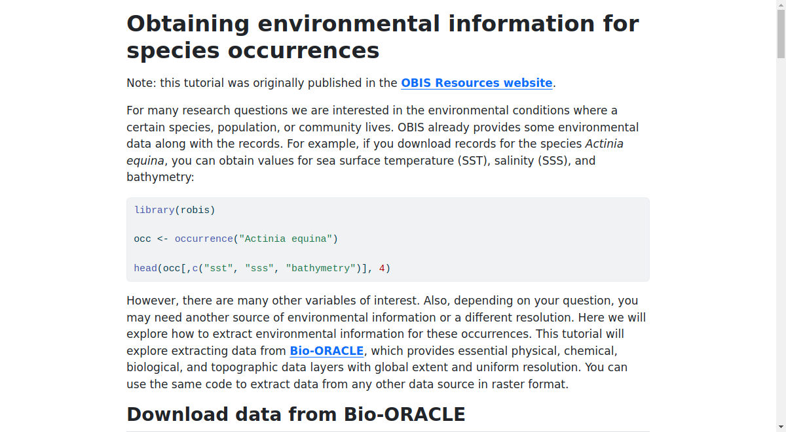

# Notebooks

Here we present some notebooks covering several topics as OBIS data access, data cleaning, environmental information extraction, and data visualization.

# R
## Environmental Data For Occurrences
[environmental_data_for_occurrences.qmd](R/environmental_data_for_occurrences.qmd)

# Python

------
_Created by the OBIS secretariat_